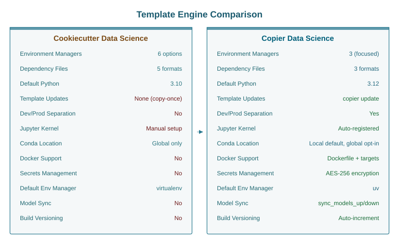
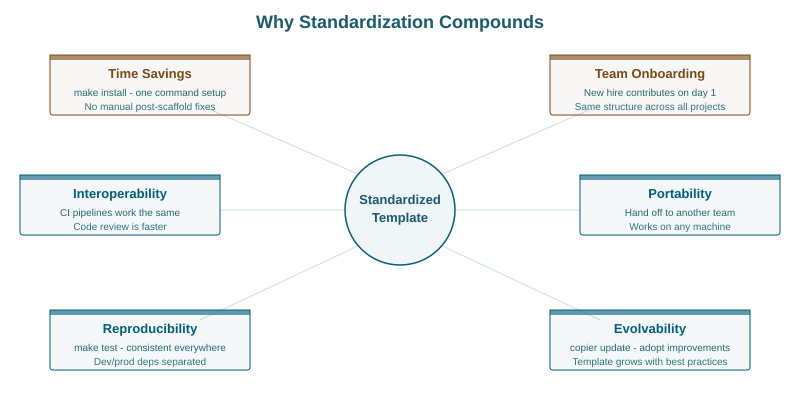
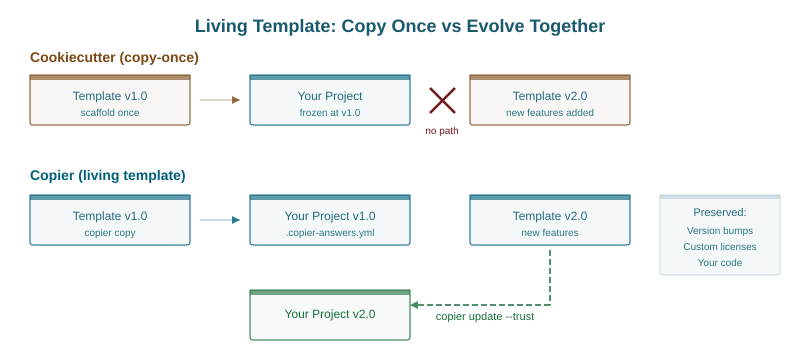
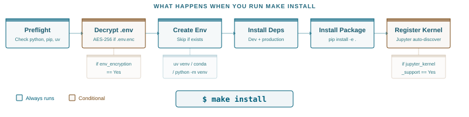
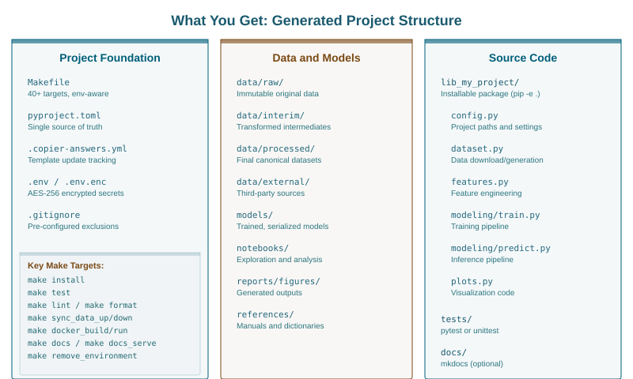
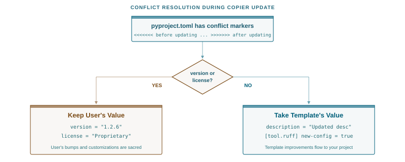
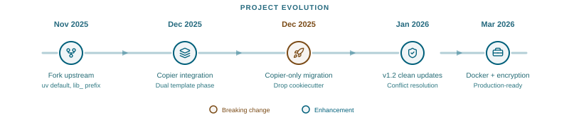

# Your Data Science Project Template Is Holding You Back


*An opinionated fork of [cookiecutter-data-science](https://cookiecutter-data-science.drivendata.org/) that grows with your project - and looking for collaborators to build it further*

---

## You want to start a data science project. The right way.

Standardized. Reproducible. The kind of project a new teammate picks up in an afternoon, not a week. Where `data/raw` means raw data, `notebooks/` means notebooks, and `make install` sets up everything without a 40-line README explaining which conda command to run first.

Right now, there is essentially one answer to this: **[cookiecutter-data-science](https://cookiecutter-data-science.drivendata.org/)** by [DrivenData](https://www.drivendata.org/). Version 2, mature, well-documented, widely adopted. It established the conventions most of us follow. The directory structure. The opinions about immutable data. The DAG philosophy. The idea that `make` is your task runner.

These are good ideas. Battle-tested. We owe a lot to that project.

But is it truly the best we can do in 2026?

I started asking that question about a year ago. Not because [cookiecutter-data-science](https://cookiecutter-data-science.drivendata.org/) is bad - it is not. But because every time I scaffolded a new project, I found myself making the same manual changes. Switching to uv. Separating dev dependencies. Setting up the Jupyter kernel. Fixing the conda environment to be local, not global. Removing virtualenvwrapper. Every single time.

A standardized template should eliminate repetitive setup, not create it. That repeated manual work is exactly the problem templates are supposed to solve. When your team of five data scientists all make slightly different post-scaffold modifications, you have lost the standardization you were after. Projects drift. Onboarding slows down. The new hire spends their first day untangling environment setup instead of reading notebooks.

So I built [something different](https://github.com/stellarshenson/copier-data-science).


## What cookiecutter-data-science got right

Credit where due. The upstream project established conventions that the data science community needed:

- **Directory structure** that separates raw data, interim results, and final outputs
- **Opinions about immutable data** and DAG-based analysis pipelines
- **Make as a task runner** for reproducible workflows
- **Source code as a package** that you can import from notebooks via `from lib_my_project.dataset import make_dataset`
- **Separation of notebooks and source code** with clear guidance on when to refactor

These are foundational. We kept all of them.

## Where the cracks show

The upstream template offers 6 environment managers: virtualenv, conda, pipenv, uv, pixi, and poetry. Five dependency file formats. It defaults to Python 3.10 and virtualenvwrapper.

This breadth comes at a cost. More choices means more configurations to maintain, more edge cases to test, and more surface area for things to break. For a project template, which shapes how thousands of developers work, this matters. Every option you offer is an option a new team member has to understand.

Here is what I kept running into:

- **No dev/prod separation** - all dependencies in one file, so your Docker image ships with pytest and black
- **Global conda environments by default** - which pollute the base env and conflict across projects
- **Manual Jupyter kernel setup** - no auto-registration, no cleanup when the environment is removed
- **No template updates** - cookiecutter is copy-once. The template improves, your project stays frozen. Six months later, new best practices exist but your project has no path to adopt them
- **No environment existence checks** - `make create_environment` tries to recreate what already exists
- **virtualenvwrapper** instead of standard venv - an extra dependency for something Python already handles

None of these are bugs. They are design decisions from a different era. The Python ecosystem has moved on.



## Why standardization matters more than you think

A standardized project template is not just about saving 20 minutes of setup. It is about **promoting best practices**, **interoperability**, and **portability**.

A template is an opinionated statement about how projects should be structured. It encodes decisions about tooling, dependency management, testing, and deployment that would otherwise be made ad hoc by each team member. When those decisions are good, every new project starts with a solid foundation. When they are outdated, every new project inherits technical debt from day one.

This template is the result of collaboration with over 30 data scientists from around the world - people working in manufacturing, scientific research, and academia. The conversations were consistent: everyone wanted uv instead of pip, local environments instead of global ones, dev dependencies separated from production, and a template that could actually be updated after the initial scaffold. The result is an opinionated template with broad capabilities - environment management across three major tools, cloud storage integration for S3, Azure, and GCS, optional Docker packaging, encrypted secrets, automatic Jupyter kernel registration, and a Makefile with 40+ targets that adapts to your configuration choices.

When every project in your organization follows the same structure, the benefits compound. A data scientist moving between projects does not have to relearn environment setup. The CI pipeline works the same way. Code review is faster because reviewers know where to look. The intern can contribute on day one because `make install` does what it says.

**Portability** is the overlooked advantage. When you hand off a project to another team, move it to a different machine, or revisit it a year later, a standardized template means you already know how it works. `make test` runs tests. `make lint` checks formatting. `make sync_data_down` pulls the dataset. No archaeology required.

This only works if the template reflects current best practices. A template frozen at Python 3.10 and virtualenvwrapper is not standardization - it is a time capsule.



## The Copier difference

The single biggest limitation of cookiecutter is that it is copy-once. You scaffold a project, cookiecutter's job is done. The template improves, adds Docker support, fixes a dependency issue - none of that reaches your existing project.

**[Copier](https://copier.readthedocs.io/)** changes this relationship from one-time copy to living connection. Your template choices are stored in `.copier-answers.yml`:

```yaml
# Changes here will be overwritten by Copier; NEVER EDIT MANUALLY
_src_path: https://github.com/stellarshenson/copier-data-science.git
_commit: v1.2.15
environment_manager: uv
dependency_file: pyproject.toml
dataset_storage: s3
docker_support: 'Yes'
```

When the template improves, one command applies the changes while preserving your modifications:

```bash
copier update --trust
```

Copier computes the diff between the old and new template versions, merges your customizations, and only asks about conflicts it cannot resolve automatically. Your version bumps, custom licenses, and project-specific code stay intact.

This is what makes a template truly portable. You can hand a project to someone in a different office, on a different machine, and they can update it to the latest template version with a single command. The project carries its own configuration history.



## Opinionated choices, explained

We stripped the options down to what works well and dropped everything else.

**3 environment managers, not 6.** uv (default), conda, and virtualenv. We intentionally removed pipenv, poetry, and pixi. These tools add complexity without proportional benefit for data science workflows. If you need them, use upstream.

**uv as the default.** It is fast, it handles dependency resolution correctly, and it is where the Python packaging ecosystem is heading. Creating a project environment takes seconds:

```makefile
create_environment: preflight
	@if [ -d "$(PROJECT_DIR)/.venv" ]; then \
		echo "$(MSG_PREFIX) virtual environment already exists"; \
	else \
		uv $(UV_OPTS) venv -q --python $(PYTHON_VERSION); \
		uv $(UV_OPTS) pip install -q --python $(PROJECT_DIR)/.venv -e ".[dev]"; \
	fi
```

**Local environments by default.** A `.venv/` directory in the project root. Not a global conda env that pollutes your base installation. Easier for CI, Docker, editors, and teammates. For conda users, we still offer a global option - but you have to opt in.

**`lib_` prefix for modules.** Your project code lives in `lib_my_project/`, not `my_project/`. This avoids conflicts with common package names and makes imports immediately recognizable - you know at a glance whether you are importing your code or a pip-installed dependency.

**Dev/prod dependency separation.** Development tools (pytest, ruff, mkdocs) are separate from production dependencies. Your Docker image does not ship with your linter:

```toml
[project.dependencies]
python-dotenv = "*"
loguru = "*"

[project.optional-dependencies]
dev = [
    "pytest",
    "ruff",
    "mkdocs",
    "ipython",
]
```

**Automatic Jupyter kernel registration.** `make create_environment` registers the kernel. `make remove_environment` cleans it up. Uses nb_venv_kernels or nb_conda_kernels for automatic discovery, with ipykernel fallback. Your project environment appears in JupyterLab without manual setup.

**Optional .env encryption.** `make .env.enc` encrypts your secrets with OpenSSL AES-256. Commit the encrypted file, share the password out-of-band. On `make install`, team members enter the password once. No more "ask Sarah for the .env file" onboarding step.

**Optional Docker support.** A Dockerfile that installs from wheel (not source), an entrypoint with run/train/predict commands, and `make docker_build` / `make docker_run` / `make docker_push` targets. Toggled by a single option during scaffolding.



## Getting started

```bash
# Install copier
pipx install copier

# Scaffold a new project
copier copy --trust gh:stellarshenson/copier-data-science my-project  # https://github.com/stellarshenson/copier-data-science

# Set up everything
cd my-project
make install
```

The interactive prompts ask about your environment manager, dependency file, cloud storage, Docker support, linting tool, and testing framework. Every choice is conditional - you only see questions relevant to your previous answers. S3 bucket names only appear if you picked S3. Docker package manager only if you enabled Docker.

What you get:

```
my-project/
├── Makefile              # 40+ targets, conditional on your choices
├── pyproject.toml        # Metadata, deps, tool config - single source of truth
├── .copier-answers.yml   # Your choices, for future template updates
├── data/                 # raw/, interim/, processed/, external/
├── notebooks/            # Jupyter notebooks
├── models/               # Trained models
├── lib_my_project/       # Your importable source code
│   ├── config.py
│   ├── dataset.py
│   ├── features.py
│   ├── plots.py
│   └── modeling/
│       ├── train.py
│       └── predict.py
├── tests/                # pytest or unittest
├── docs/                 # mkdocs (optional)
└── docker/               # Dockerfile + entrypoint (optional)
```

One command to install. One command to test. One command to lint. One command to update when the template improves. This is what standardization looks like in practice - every project in your organization works the same way, and a new team member runs `make install` and starts contributing.



## The hard part: updates that do not break

Template updates sound simple until you try to implement them. The user bumped their version from 0.1.0 to 1.2.6. The new template still has version 0.1.0 as a placeholder. Who wins?

Our post-generation script handles this intelligently:

```python
def resolve_conflict(match):
    before = match.group(1)  # User's version
    after = match.group(2)   # Template's version

    # User's version and license are sacred
    if "license" in before.lower() or "version" in before.lower():
        return before
    # Everything else: take the template's improvements
    return after
```

Version bumps and custom licenses survive template updates. New dependency configurations and tool settings flow in from the template. This is the kind of detail that only matters when it breaks - and when it breaks, it really breaks.





## Limitations

We are honest about the trade-offs:

- **Fewer environment managers** - if you need pipenv, poetry, or pixi, this template is not for you
- **Copier is less popular than cookiecutter** - smaller community, fewer Stack Overflow answers
- **Young project** - the template has been through 100+ iterations and has comprehensive tests, but it has not been battle-tested by thousands of teams yet
- **Makefile-based** - if your team prefers task runners like Just or Invoke, you will need to adapt
- **Opinionated** - that is the point, but it means some choices are made for you

## Looking for collaborators

This project stands on the shoulders of [DrivenData's](https://www.drivendata.org/) excellent work. We kept their architecture, their opinions about data management, and their philosophy about reproducibility. We changed the scaffolding, the defaults, and added features we believe data science teams need in 2026.

But one person maintaining a project template is not sustainable. Templates need diverse perspectives - different team sizes, different domains, different workflows.

**What needs building:**

- More testing across platforms (Windows, macOS CI)
- Pixi integration for those who want it
- GPU/CUDA environment setup patterns
- MLflow/experiment tracking integration
- Better documentation and examples
- Real-world feedback from teams using it

**How to contribute:**

The project is open source at [github.com/stellarshenson/copier-data-science](https://github.com/stellarshenson/copier-data-science). The test suite covers 70+ configurations. The philosophy document explains every design decision. Issues and PRs are welcome.

If you have ever looked at your data science project scaffold and thought "this could be better" - come build it with us.

---

*Stellars Henson is a data scientist and CTO specializing in AI solutions for predictive maintenance. The [copier-data-science](https://github.com/stellarshenson/copier-data-science) template grew out of building dozens of ML projects and wanting the same solid foundation every time.*
